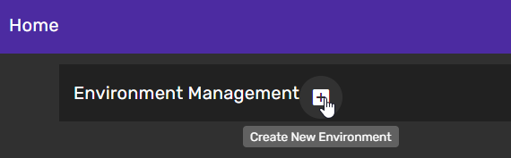
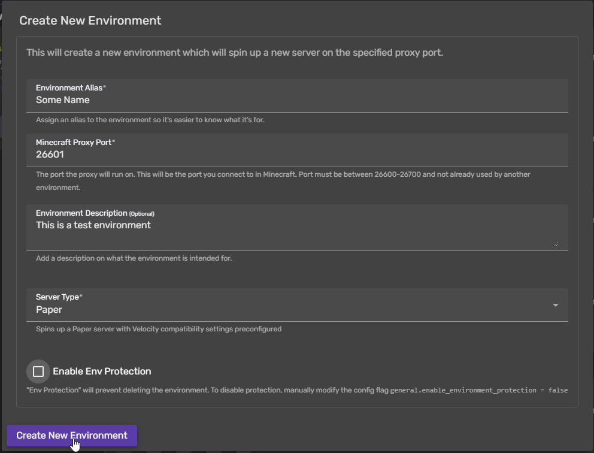
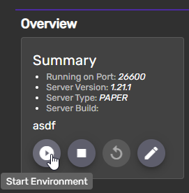
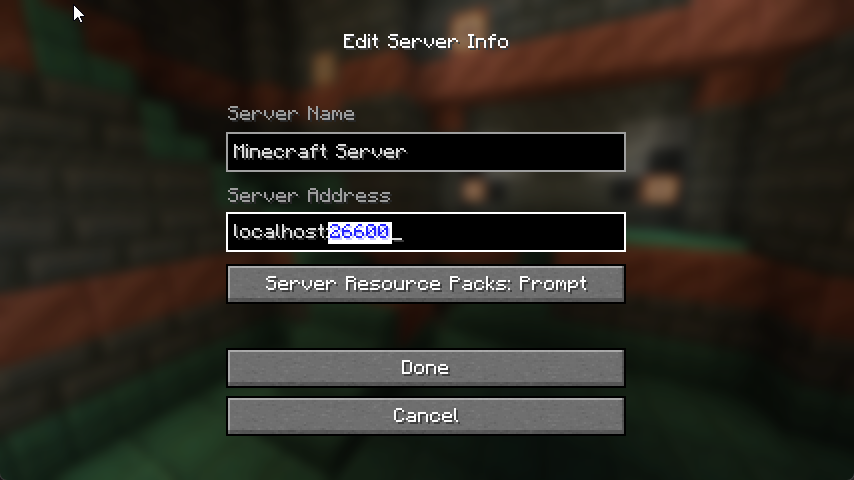

# Yakumo Dash

WebUI dashboard for managing `Yukkuricraft/Yukkuricraft`

## Description

YakumoDash is a custom built web interface for managing all aspects of Yukkuricraft software infrastructure. It relies on the `Yukkuricraft/Yukkuricraft` backend API server.

Currently implemented features:

- Ability to create/delete/modify "Environments" on the fly. An environment is a fully self-contained cluster of containers to run a Minecraft server with a server proxy and other aux containers.
- Ability to connect to a two-way server console for any server running in any environment.
- ~~Ability to install and configure plugins~~ Soon TM

Why "Yakumo" Dash? Managing all these "views" into areas of the server feels like gapping around the internals. Esp with the ability to make edits, like reaching into the gap. Gap hag etc.

## Developing Locally
- Set up and start [Yukkuricraft/Yukkuricraft](https://github.com/Yukkuricraft/Yukkuricraft/blob/main/docs/developing_locally.md) first
- Clone this repo
- `make build`
- `make up_node`
- http://yakumo.localhost
- It should "just work"

## Creating and Connecting to a Cluster Locally
1. Create a new cluster
    - 
2. Configure the cluster
    - Remember the proxy port you use. You will use this to connect to the server.
    - 
3. Start the cluster
    - 
4. Connect to the cluster
    - 
